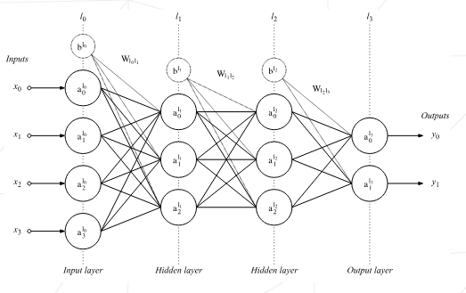
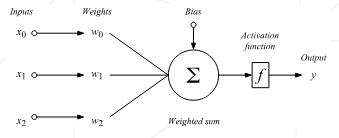

# multilayer-perceptron

This project is an educational implementation of a **Multilayer Perceptron (MLP)** neural network from scratch. It is designed to classify whether a breast cancer diagnosis is malignant or benign, using the **Wisconsin Breast Cancer** dataset.

The multilayer perceptron is a feedforward network (meaning that the data
flows from the input layer to the output layer) defined by the presence of one or more
hidden layers, as well as an interconnection of all the neurons of one layer to the next.

The diagram above represents a network containing 4 dense layers (also called fully
connected layers). Its inputs consist of 4 neurons and its output consists of 2 (perfect for binary classification). The weights of one layer to the next are represented by two-dimensional matrices noted Wlj lj+1 . The matrix Wl0l1 is of size (3, 4) for example, as it contains the weights of the connections between layer l0 and layer l1.

The bias is often represented as a special neuron which has no inputs and an output
always equal to 1. Like a perceptron, it is connected to all the neurons of the following layer (the bias neurons are noted blj on the diagram above). The bias is generally useful as it allows one to “control the behavior” of a layer.

## 🧠 Perceptron

The perceptron is the type of neuron that the multilayer perceptron is composed
of. It is defined by the presence of one or more input connections, an activation
function, and a single output. Each connection contains a weight (also called a
parameter) which is learned during the training phase.

## 🧮 Activation Functions

Activation functions introduce non-linearity into the neural network, allowing it to learn complex patterns. Below are the key activation functions used in this project:

### 1. Sigmoid Function

The **sigmoid** activation function maps any real-valued number to the range (0, 1). It’s useful for binary classification and is often used in output layers when the goal is to produce probabilities.

**Formula:**

$$
\sigma(x) = \frac{1}{1 + e^{-x}}
$$

**Properties:**
- Smooth, differentiable
- Output between 0 and 1
- Can suffer from vanishing gradients

---

### 2. ReLU (Rectified Linear Unit)

The **ReLU** function is the most widely used activation in hidden layers due to its simplicity and effectiveness. It allows only positive values to pass through.

**Formula:**

$$
\text{ReLU}(x) = \max(0, x)
$$

**Properties:**
- Fast to compute
- Avoids saturation in the positive domain
- Can suffer from "dying ReLUs" (neurons stuck at 0)

---

### 3. Softmax Function

The **softmax** function is typically used in the output layer for **multi-class** or **binary classification (2 neurons)**, as it converts raw logits into a probability distribution over multiple classes.

**Formula** (for output vector `z = [z₁, z₂, ..., zₖ]`):

$$
\text{softmax}(z_i) = \frac{e^{z_i}}{\sum_{j=1}^{K} e^{z_j}}
$$

**Properties:**
- Outputs sum to 1 (interpreted as probabilities)
- Amplifies differences between values
- Often paired with categorical cross-entropy loss

---

These functions are crucial for enabling the neural network to learn effectively and are chosen depending on the role of each layer in the network.

## 🧬 [Dataset](./datasets/data.csv)

- Source: [UCI Machine Learning Repository](archive.ics.uci.edu/dataset/17/breast+cancer+wisconsin+diagnostic)

- Features: 30 numerical features representing characteristics of cell nuclei

- Label: M (malignant) or B (benign)

## Resources

